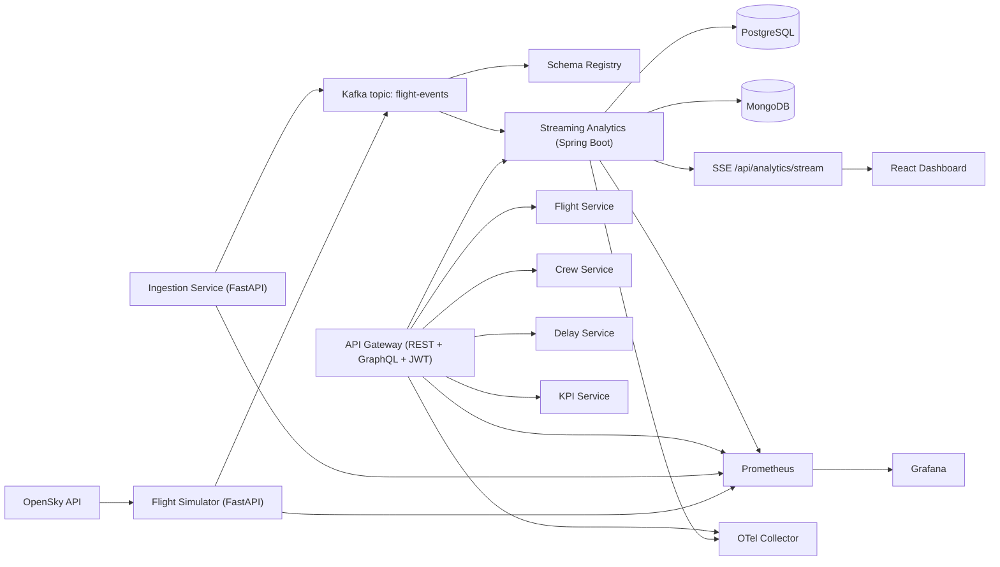

# AeroStream — Real-Time Airline Operations Intelligence Platform

<div align="center">


**A production-style, distributed aviation intelligence platform that ingests real-time flight feeds, streams events, computes KPIs, and surfaces analytics through REST, GraphQL, and an interactive dashboard.**

</div>

---

##  Why AeroStream?

AeroStream demonstrates **real-world software engineering depth** across system design, backend services, data engineering, frontend visualization, cloud operations, and DevOps automation.

### What this project proves
-  **Distributed systems understanding** (event-driven architecture with Kafka topics and consumer groups).
-  **Polyglot backend design** (Python ingestion + Java analytics microservices).
-  **Data platform literacy** (PostgreSQL for structured analytics, MongoDB for flexible config/cache patterns).
-  **API craftsmanship** (versioned REST + GraphQL + OpenAPI + JWT security).
-  **Cloud-native deployment mindset** (Docker, Kubernetes manifests, EKS/AKS overlays, ingress/TLS).
-  **Operational excellence** (Prometheus metrics, Grafana dashboards, CI/CD workflows).

---

## Table of Contents

1. [Business Problem](#-business-problem)
2. [Solution Overview](#-solution-overview)
3. [High-Level Architecture](#-high-level-architecture)
4. [Core Features](#-core-features)
5. [Technology Stack](#-technology-stack)
6. [Data & Event Contracts](#-data--event-contracts)
7. [Repository Structure](#-repository-structure)
8. [Local Development Setup](#-local-development-setup)
9. [API Guide (REST + GraphQL)](#-api-guide-rest--graphql)
10. [Security Design](#-security-design)
11. [Observability](#-observability)
12. [Kubernetes Deployment (EKS/AKS)](#-kubernetes-deployment-eksaks)
13. [CI/CD Pipelines](#-cicd-pipelines)
14. [Testing Strategy](#-testing-strategy)
15. [Roadmap](#-roadmap)

---

## Business Problem

Airline operations teams require up-to-the-minute visibility into flight movements, delays, and route reliability to optimize turnaround times, gate allocation, disruption management, and customer communication.

Traditional reporting stacks are often **batch-oriented** and fail to provide actionable intelligence in real time.

---

## Solution Overview

AeroStream is a **real-time airline intelligence platform** powered by:
- **Aviationstack API** as upstream flight feed (requires API key).
- **Flight Ingestion Service (FastAPI)** for polling + normalization.
- **Apache Kafka** for event streaming.
- **Flight Analytics Service (Spring Boot)** for KPI computation.
- **PostgreSQL + MongoDB** for analytics persistence and dynamic configuration.
- **React + TypeScript frontend** for live dashboards and exploratory search.

---

## System Architecture


---

### Architectural style
- **Microservices + Event-Driven + Cloud-Native**
- **Asynchronous pipeline** for decoupling ingestion and analytics
- **Multi-cloud deployability** through Kubernetes manifests and overlays

---

## Core Features

### 1) Real-time flight ingestion
- Polls Aviationstack flight endpoint.
- Normalizes heterogeneous upstream payload fields.
- Publishes canonical flight events to Kafka.

### 2) Stream analytics and KPI computation
- Consumes `flight_updates` events.
- Computes delay and route reliability KPI.
- Persists computed metrics in PostgreSQL.
- Supports dynamic route threshold configuration model in MongoDB.

### 3) API surface for clients
- **REST** endpoints (versioned under `/api/v1`).
- **GraphQL** endpoints for flexible querying.
- **Swagger/OpenAPI** docs support.

### 4) Frontend intelligence dashboard
- Live KPI chart visualization.
- Search by flight number or route/airport code.
- Tabular operational visibility for quick triage.

### 5) Ops & cloud readiness
- Dockerized services.
- Kubernetes manifests for EKS and AKS.
- ConfigMaps and Secrets.
- Prometheus + Grafana monitoring.

---

## Data & Event Contracts

### Kafka topics
- `flight_updates` → canonical per-flight updates from ingestion service.
- `delay_events` → delayed-flight focused event stream.
- `route_performance` → aggregated route-level KPI stream.

### Canonical event example (`flight_updates`)
```json
{
  "event_id": "4f2f1f11-f8d6-4b07-b5c5-8f5d2d83c1d0",
  "flight_number": "AA100",
  "airline": "American Airlines",
  "departure_airport": "JFK",
  "arrival_airport": "LAX",
  "delay_minutes": 18,
  "status": "active",
  "route_key": "JFK-LAX",
  "ingested_at": "2026-01-01T10:30:00Z"
}
```

### KPI baseline formula
```text
reliability_score = max(0, 100 - delay_minutes * 1.5)
```

---
## Tech Stack

| Layer | Technology |
|---|---|
| Runtime | Docker Compose, Kubernetes manifests, Helm |
| Event Streaming | Apache Kafka, Zookeeper, Confluent Schema Registry |
| Ingestion/Simulation | Python 3.11, FastAPI |
| Analytics | Java 17, Spring Boot, Spring Kafka, Spring Data JPA, Spring Data MongoDB |
| Datastores | PostgreSQL 15, MongoDB 6 |
| API Layer | Spring Cloud Gateway, Spring GraphQL, Spring Security (JWT) |
| UI | React 18, TypeScript, Vite |
| Observability | Micrometer, Prometheus, Grafana, OpenTelemetry Collector |
| CI/CD | GitHub Actions, GHCR |

## Repository Layout

- `gateway/` - API gateway, GraphQL resolvers, JWT auth
- `services/` - domain services, streaming analytics, ingestion, simulator
- `dashboard/` - React operations dashboard
- `schemas/` - Avro schema contracts
- `infra/` - observability, Kubernetes, Helm assets
- `docs/` - implementation and operations documentation
- `demo/` - scripts and sample data for demonstrations

## Local Setup

### Prerequisites

- Docker and Docker Compose
- Java 17+ (for local service runs)
- Python 3.11+ (for local FastAPI runs)
- Node.js 20+ (for local dashboard runs)

### Start the full stack

```bash
docker compose up -d --build
```

### Verify core endpoints

- Gateway health: `http://localhost:8080/actuator/health`
- Dashboard: `http://localhost:5173`
- Prometheus: `http://localhost:9090`
- Grafana: `http://localhost:3000`
- Schema Registry (host): `http://localhost:8085/subjects`

### Get a JWT token for gateway APIs

```bash
curl -s -X POST http://localhost:8080/auth/login \
  -H "Content-Type: application/json" \
  -d '{"username":"admin","password":"admin123"}'
```

Use `Authorization: Bearer <accessToken>` for protected gateway endpoints.

## Demo Walkthrough

A detailed script is available at [docs/demo-walkthrough.md](docs/demo-walkthrough.md).

Quick flow:

1. Start stack: `docker compose up -d --build`
2. Trigger storm mode in simulator:
   ```bash
   curl -X POST http://localhost:8091/simulation/start \
     -H "Content-Type: application/json" \
     -d '{"scenario":"storm"}'
   ```
3. Open dashboard at `http://localhost:5173` and confirm live table/propagation updates.
4. Open Grafana at `http://localhost:3000` and inspect AeroStream dashboards.
5. Validate analytics API:
   ```bash
   curl http://localhost:8086/api/analytics/routes/reliability
   ```

## API Reference

### Gateway (JWT-protected unless noted)

| Method | Path | Auth | Description |
|---|---|---|---|
| POST | `/auth/login` | No | Returns JWT token pair metadata (`accessToken`, `tokenType`). |
| POST | `/graphql` | Yes | GraphQL queries for `flightStatus`, `routePerformance`, `reliabilityScore`. |
| GET | `/api/flights/**` | Yes | Proxied flight-service APIs. |
| GET | `/api/crew/**` | Yes | Proxied crew-service APIs. |
| GET | `/api/delays/**` | Yes | Proxied delay-service APIs. |
| GET | `/api/kpis/**` | Yes | Proxied KPI APIs. |
| GET | `/api/analytics/**` | Yes | Proxied analytics APIs. |
| GET | `/actuator/health` | No | Health probe. |
| GET | `/actuator/prometheus` | No | Prometheus scrape endpoint. |

### Streaming Analytics (direct service)

| Method | Path | Description |
|---|---|---|
| GET | `http://localhost:8086/api/analytics/routes/reliability` | Latest route reliability aggregates. |
| GET | `http://localhost:8086/api/analytics/routes/configuration` | Route configuration documents from MongoDB. |
| GET | `http://localhost:8086/api/analytics/stream` | SSE stream (`route-update` events). |

### Ingestion and Simulator

| Method | Path | Description |
|---|---|---|
| POST | `http://localhost:8090/ingest/flight-events` | Publish one Avro-validated event to Kafka. |
| POST | `http://localhost:8091/simulation/start` | Start OpenSky event producer (`normal` or `storm`). |
| POST | `http://localhost:8091/simulation/stop` | Stop simulator loop. |
| GET | `http://localhost:8091/health` | Simulator health and current scenario. |

## Avro Schema Contract

AeroStream uses Avro + Schema Registry for `flight-events`.

- Active contract file: `schemas/flight-event.avsc`
- Schema Registry endpoint (host): `http://localhost:8085`
- Default subject naming strategy: topic value (`flight-events-value`)

Example payload (logical event shape):

```json
{
  "flightId": "AA1024",
  "airline": "American Airlines",
  "origin": "DFW",
  "destination": "JFK",
  "timestamp": "2026-03-10T15:42:00Z",
  "delayMinutes": 37,
  "status": "DELAYED"
}
```

For compatibility and evolution guidance, see [docs/kafka-contracts.md](docs/kafka-contracts.md).

## Observability Guide

### Metrics

- Spring services expose `/actuator/prometheus`
- Python services expose `/metrics`
- Prometheus scrape config: `infra/observability/prometheus.yml`

### Grafana

- URL: `http://localhost:3000`
- Provisioned dashboards: `infra/observability/grafana/dashboards`
- Datasource provisioning: `infra/observability/grafana/provisioning/datasources`

### Tracing

- OTLP endpoint used by services: `http://otel-collector:4318/v1/traces`
- Collector config: `infra/observability/otel-collector-config.yml`
- Current exporter: `debug` (stdout)

## Documentation

- [Local Development](docs/local-development.md)
- [Demo Walkthrough](docs/demo-walkthrough.md)
- [Kafka Contracts](docs/kafka-contracts.md)
- [Streaming Analytics](docs/streaming-analytics.md)
- [Observability](docs/observability.md)
- [CI/CD](docs/ci-cd.md)
- [Kubernetes Deployment](docs/kubernetes-deployment.md)

---

## Repository Structure

```text
.
├── services/
│   ├── flight-ingestion/     # FastAPI ingestion microservice
│   └── flight-analytics/     # Spring Boot analytics microservice
├── frontend/                 # React + TypeScript web app
├── infra/
│   ├── gateway/              # NGINX API gateway config
│   ├── k8s/                  # Base + EKS/AKS overlays
│   ├── observability/        # Prometheus + Grafana assets
│   └── scripts/              # bootstrap + topic creation scripts
├── docs/                     # architecture + setup + system design
├── scripts/                  # mock data generation
├── tests/                    # integration test plan
├── docker-compose.yml
└── README.md
```

---

## 🛠️ Local Development Setup

> Prerequisites: Docker, Docker Compose, Python 3.11+, Java 17+, Node 20+

### 1) Configure environment
Create `.env` in project root:

```bash
cp .env.example .env
# then set AVIATIONSTACK_API_KEY and JWT_SECRET
```

### 2) Launch full stack
```bash
docker compose up --build
```

### 3) (Optional) Create Kafka topics manually
```bash
./infra/scripts/create-topics.sh
```

### 4) Open local services
- Frontend: `http://localhost:3000`
- Ingestion API docs: `http://localhost:8000/docs`
- Analytics API docs: `http://localhost:8080/swagger-ui/index.html`
- Prometheus: `http://localhost:9090`
- Grafana: `http://localhost:3001`

---

## 🔌 API Guide (REST + GraphQL)

### Ingestion service (FastAPI)
**Base:** `http://localhost:8000/api/v1`

- `POST /ingest` → polls Aviationstack, normalizes, emits Kafka events.
- `GET /health` → service health.
- `GET /graphql` / `POST /graphql` → GraphQL endpoint.

Example:
```bash
curl -X POST "http://localhost:8000/api/v1/ingest?limit=25" \
  -H "Authorization: Bearer <jwt-token>"
```

### Analytics service (Spring Boot)
**Base:** `http://localhost:8080/api/v1/analytics`

- `GET /` → list all KPI records.
- `GET /flight/{flightNumber}` → KPI by flight.
- `GET /route/{routeKey}` → KPI by route.
- GraphQL endpoint: `POST /graphql`

GraphQL sample:
```graphql
query {
  analyticsByFlight(flightNumber: "AA100") {
    flightNumber
    routeKey
    delayMinutes
    reliabilityScore
    status
  }
}
```

---

## Security Design

- JWT validation on ingestion and analytics APIs.
- OAuth2 resource-server style config for Spring service.
- HTTPS/TLS termination at ingress/API gateway.
- Secrets kept in Kubernetes `Secret` resources.
- Configuration externalized via `ConfigMap`.

---

## Observability

### Metrics
- Ingestion service: `/metrics`
- Analytics service: `/actuator/prometheus`

### Monitoring
- Prometheus scrapes both services.
- Grafana provisions dashboard for request and JVM visibility.

### Why this matters
- Faster incident detection.
- Better SLO tracking.
- Easier capacity planning and performance tuning.

---

## ☁️ Kubernetes Deployment (EKS/AKS)

### Apply AWS EKS overlay
```bash
kubectl apply -k infra/k8s/eks
```

### Apply Azure AKS overlay
```bash
kubectl apply -k infra/k8s/aks
```

### Included assets
- Namespace
- ConfigMap + Secret
- Deployments + Services
- Ingress with TLS host routing

---

## 🔁 CI/CD Pipelines

### GitHub Actions
- **CI workflow**: install dependencies, run tests, build frontend.
- **Docker publish workflow**: build/push images to GHCR on tags.

### Azure DevOps
- Multi-stage pipeline:
  1. Build and test
  2. Deploy to EKS
  3. Deploy to AKS

---

## Testing Strategy

- **Unit tests**
  - Python (`pytest`) for normalization logic.
  - Java (`JUnit`) for KPI reliability scoring.
- **Integration plan**
  - End-to-end validation across ingestion → Kafka → analytics → databases → API responses.
- **Mock data tooling**
  - `scripts/generate_mock_data.py` for realistic synthetic event generation.

Run tests:
```bash
pytest services/flight-ingestion/tests
mvn -f services/flight-analytics/pom.xml test
```

---

## Roadmap

- [ ] Add schema registry (Avro/Protobuf) for strongly governed event contracts.
- [ ] Implement dead-letter queue + retry strategy for malformed events.
- [ ] Add route-level windowed aggregations in analytics service.
- [ ] Add RBAC policies for fine-grained role-based API access.
- [ ] Add OpenTelemetry tracing across services.
- [ ] Add map-based UI for geospatial flight visualization.

---

## Commit Structure Guidance

Use atomic commits with clear intent and a single concern per commit.

Recommended convention:

- `feat:` new behavior or endpoint
- `fix:` bug or regression correction
- `docs:` README/docs only
- `chore:` tooling, dependency, or non-behavioral maintenance
- `refactor:` structural code cleanup without behavior change
- `test:` test additions/updates

Suggested breakdown for remaining work:

1. `docs(readme): unify project narrative and architecture sections`
2. `docs(demo): add end-to-end storm walkthrough with verification steps`
3. `docs(kafka): document avro contract, sample payload, and evolution policy`
4. `feat(simulator): support storm scenario delay generation for demo realism`
5. `fix(ci): align dashboard typing/env setup and pipeline action versions`

Each commit should answer: what changed, why it changed, and how it was validated.
