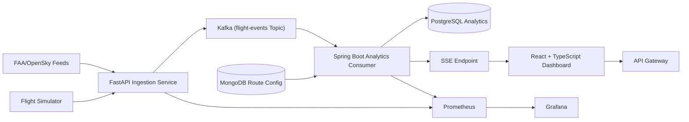

# AeroStream: Real-Time Airline Operations Intelligence Platform

AeroStream is a production-style, event-driven distributed systems portfolio project focused on airline operations intelligence. The platform ingests flight events, analyzes delay propagation in near real time, and publishes route reliability metrics to APIs and live dashboards.

## System Architecture

## Dual Database Architecture

AeroStream uses a dual database architecture to separate workloads and optimize each persistence model:

- PostgreSQL (`jdbc:postgresql://postgres:5432/aerostream`) stores analytics records such as route reliability snapshots.
- MongoDB (`mongodb://mongo:27017/aerostream`) stores route configuration documents used by streaming analytics.
- All previous MySQL dependencies and runtime services have been removed from the platform.

## Event Streaming Architecture

AeroStream uses Kafka as the event backbone for near-real-time processing:

- Producer: `services/ingestion-service` publishes flight events to topic `flight-events`.
- Broker: Kafka receives and persists the event stream.
- Consumer: `services/streaming-analytics` consumes from `flight-events` with Spring Kafka (`spring-kafka`).
- Bootstrap servers: `spring.kafka.bootstrap-servers=kafka:9092`.
## Event Flow

1. Flight events are produced by FAA/OpenSky connectors or the simulator.
2. FastAPI ingestion publishes validated flight events to Kafka topic `flight-events`.
3. Spring Boot analytics services consume `flight-events` using Spring Kafka listeners.
4. Reliability scores are persisted to PostgreSQL and pushed via SSE.
5. Route configuration is read from MongoDB.
6. Dashboard renders live route metrics.
7. Prometheus and Grafana expose operational health and performance.

## Infrastructure Design

- Runtime: Docker Compose for local multi-service environment.
- Event Backbone: Kafka + Zookeeper.
- Data: PostgreSQL (analytics and service persistence), MongoDB (route config).
- Observability: Prometheus, Grafana provisioning, OpenTelemetry collector.
- Deployment: Helm chart + env values + Kustomize overlays + ArgoCD app.
- CI/CD: GitHub Actions with test/build/image scan/publish flow.

## Tech Stack

- Python FastAPI (`services/ingestion-service`, `services/flight-simulator`)
- Apache Kafka event streaming (`flight-events` topic)
- Java Spring Boot + Spring Kafka consumer (`services/streaming-analytics`)
- React + TypeScript dashboard (`dashboard`)
- Docker + Kubernetes/Helm + ArgoCD GitOps

## Local Setup

1. Copy env template:
   - `cp .env.example .env`
2. Start platform:
   - `docker compose up -d --build`
3. Open services:
   - Gateway: `http://localhost:8080`
   - Ingestion: `http://localhost:8090`
   - Simulator: `http://localhost:8091`
   - Streaming Analytics: `http://localhost:8086`
   - Dashboard: `http://localhost:5173`
   - Prometheus: `http://localhost:9090`
   - Grafana: `http://localhost:3000`

Detailed docs:

- `docs/local-development.md`
- `docs/kafka-contracts.md`
- `docs/streaming-analytics.md`
- `docs/observability.md`
- `docs/kubernetes-deployment.md`
- `docs/realtime-dashboard.md`

## Demo Instructions

- Quick demo script (PowerShell): `demo/scripts/run_demo.ps1`
- Quick demo script (bash): `demo/scripts/run_demo.sh`
- Walkthrough: `docs/demo-walkthrough.md`
- Example dataset: `demo/datasets/sample_flights.jsonl`

2-minute demo strategy:

1. `docker compose up -d --build`
2. Start simulator storm scenario.
3. Show dashboard live route updates.
4. Show Grafana metrics and reliability API.

## Engineering Decisions

- Kafka topics decouple producers and consumers for scalable event streaming.
- Spring Kafka consumers provide simple, reliable real-time event processing.
- SSE for low-overhead live updates without websocket broker complexity.
- Split operational data stores by workload: PostgreSQL analytics + MongoDB route config.
- OTel + Prometheus metrics first-class for production debugging and SLO tracking.
- Helm + ArgoCD for repeatable environment promotion (dev/staging/prod).

## Repository Structure

- `gateway/`
- `services/`
- `dashboard/`
- `infra/`
- `schemas/`
- `docs/`
- `demo/`

## Current Status

The project now includes:

- local distributed stack bootstrapping
- schema-governed Kafka eventing
- synthetic delay scenario simulation
- streaming analytics with route reliability scoring
- real-time dashboard updates
- production-style observability and CI/CD assets
- Kubernetes Helm + GitOps deployment scaffolding
