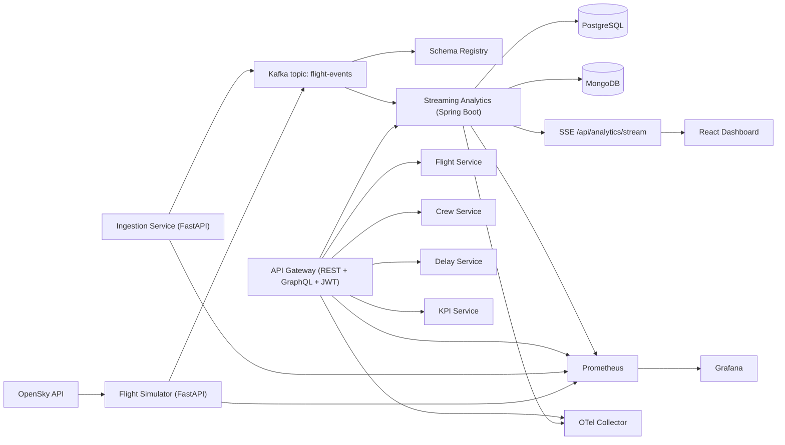

# AeroStream

AeroStream is an event-driven airline operations platform that ingests live flight signals, computes delay-propagation analytics, and publishes route reliability metrics to APIs, dashboards, and observability tools.

## Overview

AeroStream demonstrates a production-style microservices architecture with:

- FastAPI ingestion and simulation services
- Kafka event streaming with Avro contracts and Schema Registry
- Spring Boot analytics and API gateway services
- Dual persistence model: PostgreSQL (analytics) and MongoDB (route configuration)
- Real-time dashboard updates via Server-Sent Events (SSE)
- Prometheus, Grafana, and OpenTelemetry collector integration

## System Architecture



## Capability Status (Built vs Planned)

| Capability | Status | Notes |
|---|---|---|
| JWT authentication | Built | Implemented in gateway (`POST /auth/login`, JWT filter, protected routes). |
| OpenTelemetry export | Built (baseline) | OTLP export is configured to `otel-collector`; collector currently uses `debug` exporter. |
| Redis caching | Planned | Not present in runtime stack yet. |
| Resilience4j fault policies | Planned | No circuit breaker/retry/bulkhead integration currently wired. |

## Tech Stack

| Layer | Technology |
|---|---|
| Runtime | Docker Compose, Kubernetes manifests, Helm |
| Event Streaming | Apache Kafka, Zookeeper, Confluent Schema Registry |
| Ingestion/Simulation | Python 3.11, FastAPI |
| Analytics | Java 17, Spring Boot, Spring Kafka, Spring Data JPA, Spring Data MongoDB |
| Datastores | PostgreSQL 15, MongoDB 6 |
| API Layer | Spring Cloud Gateway, Spring GraphQL, Spring Security (JWT) |
| UI | React 18, TypeScript, Vite |
| Observability | Micrometer, Prometheus, Grafana, OpenTelemetry Collector |
| CI/CD | GitHub Actions, GHCR |

## Repository Layout

- `gateway/` - API gateway, GraphQL resolvers, JWT auth
- `services/` - domain services, streaming analytics, ingestion, simulator
- `dashboard/` - React operations dashboard
- `schemas/` - Avro schema contracts
- `infra/` - observability, Kubernetes, Helm assets
- `docs/` - implementation and operations documentation
- `demo/` - scripts and sample data for demonstrations

## Local Setup

### Prerequisites

- Docker and Docker Compose
- Java 17+ (for local service runs)
- Python 3.11+ (for local FastAPI runs)
- Node.js 20+ (for local dashboard runs)

### Start the full stack

```bash
docker compose up -d --build
```

### Verify core endpoints

- Gateway health: `http://localhost:8080/actuator/health`
- Dashboard: `http://localhost:5173`
- Prometheus: `http://localhost:9090`
- Grafana: `http://localhost:3000`
- Schema Registry (host): `http://localhost:8085/subjects`

### Get a JWT token for gateway APIs

```bash
curl -s -X POST http://localhost:8080/auth/login \
  -H "Content-Type: application/json" \
  -d '{"username":"admin","password":"admin123"}'
```

Use `Authorization: Bearer <accessToken>` for protected gateway endpoints.

## Demo Walkthrough

A detailed script is available at [docs/demo-walkthrough.md](docs/demo-walkthrough.md).

Quick flow:

1. Start stack: `docker compose up -d --build`
2. Trigger storm mode in simulator:
   ```bash
   curl -X POST http://localhost:8091/simulation/start \
     -H "Content-Type: application/json" \
     -d '{"scenario":"storm"}'
   ```
3. Open dashboard at `http://localhost:5173` and confirm live table/propagation updates.
4. Open Grafana at `http://localhost:3000` and inspect AeroStream dashboards.
5. Validate analytics API:
   ```bash
   curl http://localhost:8086/api/analytics/routes/reliability
   ```

## API Reference

### Gateway (JWT-protected unless noted)

| Method | Path | Auth | Description |
|---|---|---|---|
| POST | `/auth/login` | No | Returns JWT token pair metadata (`accessToken`, `tokenType`). |
| POST | `/graphql` | Yes | GraphQL queries for `flightStatus`, `routePerformance`, `reliabilityScore`. |
| GET | `/api/flights/**` | Yes | Proxied flight-service APIs. |
| GET | `/api/crew/**` | Yes | Proxied crew-service APIs. |
| GET | `/api/delays/**` | Yes | Proxied delay-service APIs. |
| GET | `/api/kpis/**` | Yes | Proxied KPI APIs. |
| GET | `/api/analytics/**` | Yes | Proxied analytics APIs. |
| GET | `/actuator/health` | No | Health probe. |
| GET | `/actuator/prometheus` | No | Prometheus scrape endpoint. |

### Streaming Analytics (direct service)

| Method | Path | Description |
|---|---|---|
| GET | `http://localhost:8086/api/analytics/routes/reliability` | Latest route reliability aggregates. |
| GET | `http://localhost:8086/api/analytics/routes/configuration` | Route configuration documents from MongoDB. |
| GET | `http://localhost:8086/api/analytics/stream` | SSE stream (`route-update` events). |

### Ingestion and Simulator

| Method | Path | Description |
|---|---|---|
| POST | `http://localhost:8090/ingest/flight-events` | Publish one Avro-validated event to Kafka. |
| POST | `http://localhost:8091/simulation/start` | Start OpenSky event producer (`normal` or `storm`). |
| POST | `http://localhost:8091/simulation/stop` | Stop simulator loop. |
| GET | `http://localhost:8091/health` | Simulator health and current scenario. |

## Avro Schema Contract

AeroStream uses Avro + Schema Registry for `flight-events`.

- Active contract file: `schemas/flight-event.avsc`
- Schema Registry endpoint (host): `http://localhost:8085`
- Default subject naming strategy: topic value (`flight-events-value`)

Example payload (logical event shape):

```json
{
  "flightId": "AA1024",
  "airline": "American Airlines",
  "origin": "DFW",
  "destination": "JFK",
  "timestamp": "2026-03-10T15:42:00Z",
  "delayMinutes": 37,
  "status": "DELAYED"
}
```

For compatibility and evolution guidance, see [docs/kafka-contracts.md](docs/kafka-contracts.md).

## Observability Guide

### Metrics

- Spring services expose `/actuator/prometheus`
- Python services expose `/metrics`
- Prometheus scrape config: `infra/observability/prometheus.yml`

### Grafana

- URL: `http://localhost:3000`
- Provisioned dashboards: `infra/observability/grafana/dashboards`
- Datasource provisioning: `infra/observability/grafana/provisioning/datasources`

### Tracing

- OTLP endpoint used by services: `http://otel-collector:4318/v1/traces`
- Collector config: `infra/observability/otel-collector-config.yml`
- Current exporter: `debug` (stdout)

## Documentation

- [Local Development](docs/local-development.md)
- [Demo Walkthrough](docs/demo-walkthrough.md)
- [Kafka Contracts](docs/kafka-contracts.md)
- [Streaming Analytics](docs/streaming-analytics.md)
- [Observability](docs/observability.md)
- [CI/CD](docs/ci-cd.md)
- [Kubernetes Deployment](docs/kubernetes-deployment.md)

## Commit Structure Guidance

Use atomic commits with clear intent and a single concern per commit.

Recommended convention:

- `feat:` new behavior or endpoint
- `fix:` bug or regression correction
- `docs:` README/docs only
- `chore:` tooling, dependency, or non-behavioral maintenance
- `refactor:` structural code cleanup without behavior change
- `test:` test additions/updates

Suggested breakdown for remaining work:

1. `docs(readme): unify project narrative and architecture sections`
2. `docs(demo): add end-to-end storm walkthrough with verification steps`
3. `docs(kafka): document avro contract, sample payload, and evolution policy`
4. `feat(simulator): support storm scenario delay generation for demo realism`
5. `fix(ci): align dashboard typing/env setup and pipeline action versions`

Each commit should answer: what changed, why it changed, and how it was validated.
